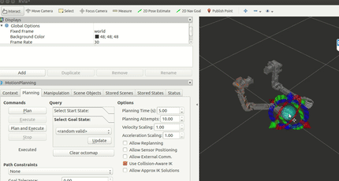
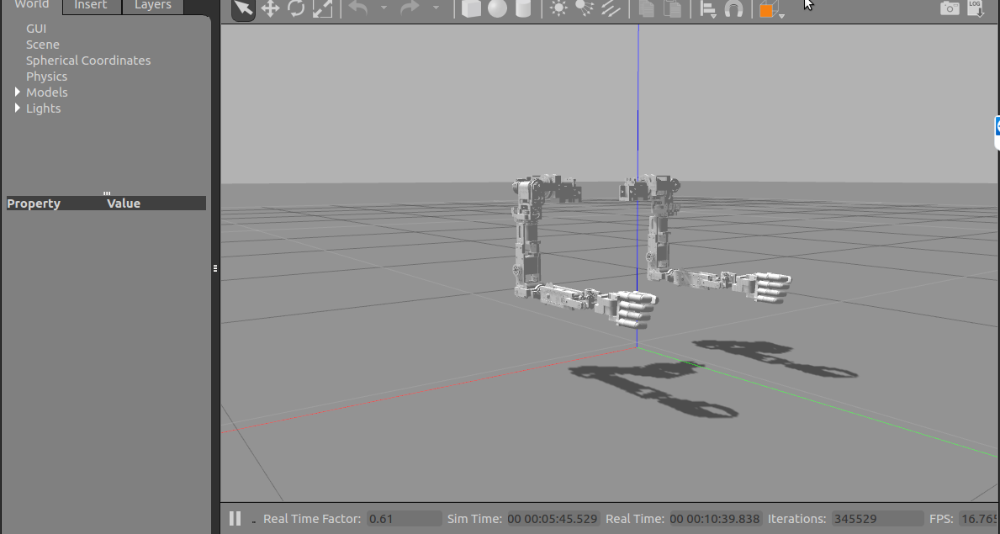
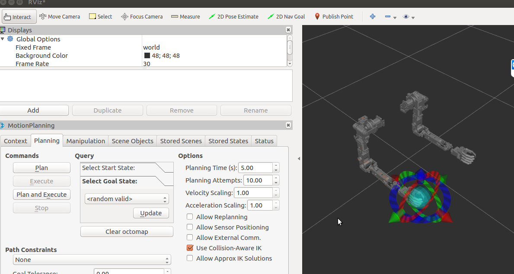
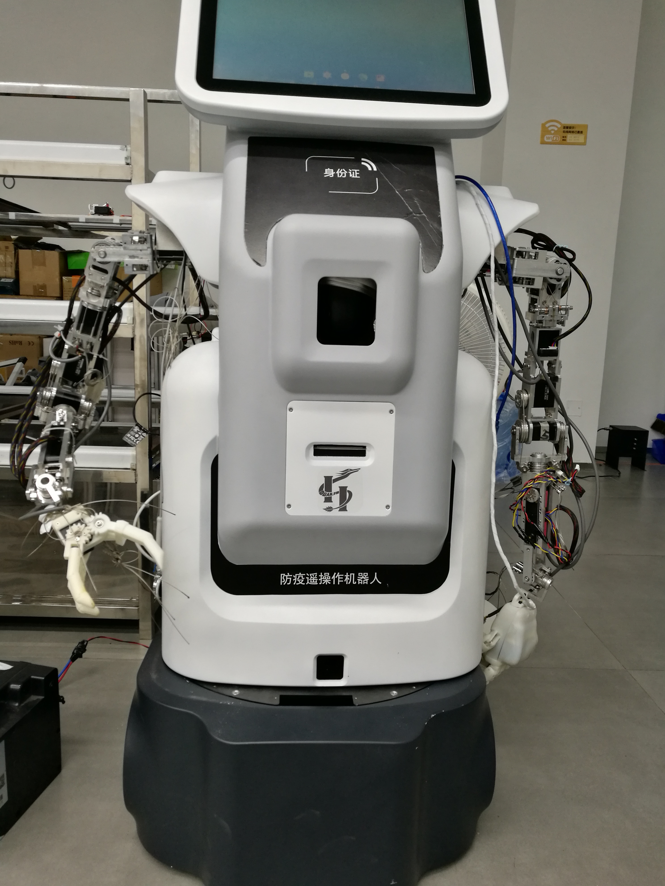
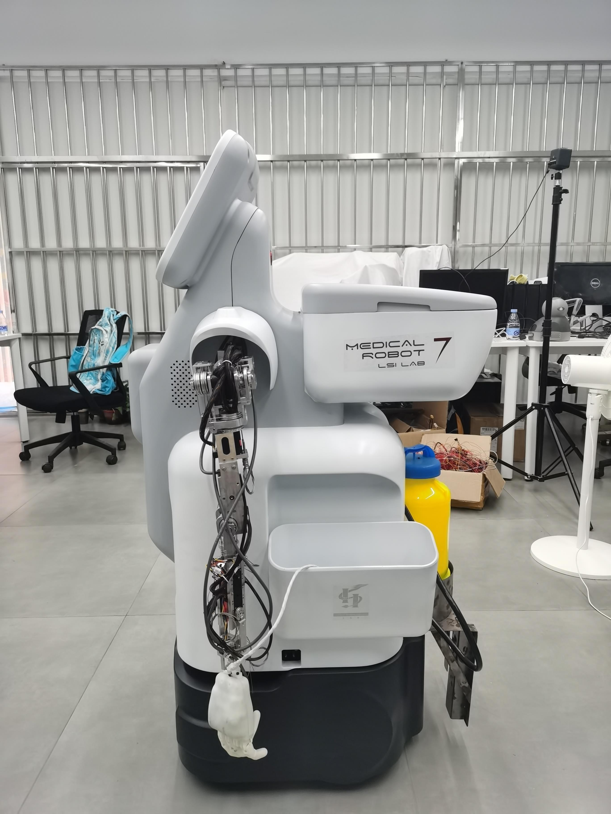

# ROS_hack
A ROS reposity about flexible dual-arm.
## Simulation
- only load Gezebo model: **roslaunch bmirobot_gazebo bmirobot_two_world.launch**  
- load Gazebo and ros_controller: **roslaunch bmirobot_gazebo bmirobot_gazebo_control.launch**  
- communication between Gazebo and Rviz: **roslaunch bmirobot_gazebo bmirobot_gazebo_moveit.launch**  
- [trajectory planning under Moveit Framework: video link](https://www.bilibili.com/video/BV1S5411Y7DX/)  
  

  </ br> 

## Real System
- launch right arm: **roslaunch bmirobot_hw bmirobot_zhs_right.launch**  
- launch dual-arm: **roslaunch bmirobot_hw bmirobot_zhs_two.launch**  
- simutaneously launch move_group node and rviz: **roslaunch bmirobot_py bmirobot_rviz.launch**  
- tele-operation using keyboard: **rosrun bmirobot_py move_group_tele_key2.py**  
<table>
    <tr>
        <td >
Front face
</td>
        <td >
Side face
</td>
    </tr>
</table>

## Tele-operation
- slave host: **roslaunch omni_common omni_state.launch** &ensp;(ref: [Geomagic 3D touch driver](https://github.com/bharatm11/Geomagic_Touch_ROS_Drivers))  
- master host: **rosrun bmirobot_py ik_grasp_touch.py**  
- [tele-operation in simulation: 知乎](https://www.zhihu.com/zvideo/1263759151160860672) 
- [tele-operation in Gazebo: B站](https://www.bilibili.com/video/BV1vK4y1s7YH/) &ensp;[tele-operation in Rviz: B站](https://www.bilibili.com/video/BV1QK4y1s7TJ/)  
  
  

